<div align="center">

# EsnafPano

**Mahallendeki esnafı keşfet. İş fırsatlarını bul. İlanını yayınla.**

Yerel işletmeleri, hizmet verenleri ve iş arayanları aynı panoda buluşturan Türkçe ilan platformu.


[](LICENSE.txt)

[Kurulum](#kurulum) · [Kullanım](#kullanım) · [Ekran görüntüleri](#ekran-görüntüleri) · [Komutlar](#komutlar) · [Lisans](#lisans) · [Sorun giderme](#sorun-giderme)

**Geliştirici:** [Bewrq](https://github.com/Bewrq) · **Marka:** [Replyfe](http://replyfe.com/)

</div>

## Proje hakkında

EsnafPano; işletme tanıtımı, eleman arama, iş arama, hizmet ilanları, dükkan devri ve araç satışını tek arayüzde birleştirir. Şehir, kategori ve fiyat filtreleriyle ilanlar bulunur; ilan sahipleriyle site içi mesajlaşma, soru-cevap, telefon ve WhatsApp üzerinden iletişim kurulur.

Proje **npm workspaces** kullanır. Kaynak kod `app/client/` ve `app/server/` altında düzenli kalır; bağımlılıklar ve komutlar **proje kökünden** yönetilir. Her klasöre ayrı ayrı girip kurulum yapmanız veya iki ayrı sunucu başlatmanız gerekmez.

## Özellikler

| Modül | İşlev |
| --- | --- |
| İlan panosu | Kategori, şehir, arama metni ve fiyat filtreleri; öne çıkan ilanlar. |
| İşletme tanıtımı | Sektör, hizmet etiketleri, çalışma saatleri ve sosyal bağlantılar. |
| İlan oluşturma | Kategori/konum, detaylar, fotoğraflar ve iletişimden oluşan dört adım. |
| Fotoğraf yükleme | Cihazdan görsel seçme, bağlantı ekleme ve tarayıcıda optimizasyon. |
| İlanlarım | Kendi ilanlarını düzenleme, yayında/satıldı durumunu değiştirme ve silme. |
| Mağaza profili | İlan sahibinin ilanları, profil düzenleme ve paylaşılabilir mağaza QR kodu. |
| Mesajlar ve sorular | Giriş yapan kullanıcılar için özel sohbet ve ilan altında soru-cevap. |
| İletişim | Telefon girilmişse arama ve WhatsApp bağlantıları. |
| Yönetici paneli | Kullanıcı/ilan yönetimi, kategori/şehir dağılımları ve moderasyon. |
| Mobil ve konum | Mobil arayüz ve konum izniyle en yakın şehir filtresi. |

**Kategoriler:** Dükkan & İşletme Tanıtımı, Kafe & Restoran, Oto Sanayi & Araç Bakım, İş Arıyorum, Eleman Aranıyor, Dükkan Devir/Kiralama, Hizmet/Ustalık, Vasıta & Araç ve Motosiklet.

## Kurulum

### 1. Gereksinimler

- **Node.js 22 LTS ve npm 10 veya üzeri.** Desteklenen alt sınır Node.js 20.19'dur. [Node.js indirme sayfası](https://nodejs.org/en/download/).
- İlk paket ve yerel MongoDB indirmesi için internet bağlantısı.
- Klonlama için Git; alternatif olarak GitHub'dan **Code → Download ZIP**.

MongoDB'yi ayrıca kurmanız gerekmez. `MONGODB_URI` boşken `npm start`, yerel MongoDB'yi otomatik indirip başlatır. Windows'ta ilk MongoDB indirmesi yaklaşık **600 MB** olabilir; tamamlanmasını bekleyin. Sonraki açılışlarda indirilen dosya kullanılır.

```bash
node --version
npm --version
```

### 2. Projeyi indirin

Adres içindeki kullanıcı ve depo adını kendi GitHub adresinizle değiştirin:

```bash
git clone https://github.com/GITHUB_KULLANICINIZ/DEPO_ADINIZ.git
cd DEPO_ADINIZ
```

ZIP ile indirdiyseniz arşivi açıp **kök `package.json` dosyasının bulunduğu klasörde** terminal açın. Bu bilgisayardaki proje için:

```powershell
cd "$HOME\Desktop\Newproje"
```

### 3. Kurun ve başlatın

```bash
npm install
npm start
```

Tarayıcıdan **[http://localhost:5173](http://localhost:5173)** adresini açın.

İlk açılışta `global/config/.env` ve benzersiz JWT oturum anahtarı oluşturulur; yerel veritabanı, API ve React arayüzü birlikte açılır. Veritabanı bağlanmadan API hazır sayılmaz.

| Adres | Amaç |
| --- | --- |
| `http://localhost:5173` | Geliştirme arayüzü |
| `http://localhost:5000/api/health` | API ve veritabanı sağlık kontrolü |

**Ctrl+C** ile durdurun. Yerel kullanıcılar, ilanlar ve mesajlar `global/data/mongodb/` içinde saklanır ve sonraki açılışta korunur. `global/data/` ve `global/config/.env` GitHub'a gönderilmez.

> PowerShell `npm.ps1 çalıştırılamıyor` hatası verirse `npm.cmd install` ve `npm.cmd start` kullanın. Sistemin execution policy ayarını değiştirmeniz gerekmez.

### 4. İsteğe bağlı demo kurulumu

Site açıkken **ikinci terminalde, proje kökünde** çalıştırın:

```bash
npm run seed
```

Komut 12 örnek ilan, üç demo hesabı ve bir örnek sohbet ekler. Mevcut kayıtları silmez; tekrar çalıştırıldığında aynı demo ilanlarını çoğaltmaz. Site kapalıyken de yerel veritabanını geçici olarak açıp verileri ekleyebilir.

| Hesap | E-posta | Şifre |
| --- | --- | --- |
| Esnaf | `esnaf@esnafpano.com` | `password123` |
| Bireysel | `bireysel@esnafpano.com` | `password123` |
| Demo yönetici | `admin@esnafpano.example` | `password123` |

Demo hesapları geliştirme ve tanıtım içindir; üretimde kurmayın. Harici bir **geliştirme** veritabanına bilerek örnek veri eklemek için `npm run seed -- --allow-external` kullanılır.

## Kullanım

### İlanları keşfetme

Ana sayfada şehir ve arama metni seçip arama yapın. Kategori bağlantıları ve filtre alanıyla sonuçları daraltın. İlan kartına tıklayıp açıklama, konum, fotoğraflar ve ilan sahibi bilgilerini inceleyin. Telefon paylaşılmışsa arama/WhatsApp bağlantıları; giriş yapılmışsa özel mesaj ve soru-cevap alanları kullanılabilir.

### Hesap oluşturma

**Kayıt Ol** sayfasında ad, e-posta, telefon ve şifre bilgilerini doldurun. **Giriş Yap** sayfasında e-posta veya telefon numarasıyla giriş yapın. Girişten sonra **İlan Ver**, **İlanlarım**, **Mağazam** ve **Mesajlarım** bağlantılarını kullanabilirsiniz.

### İlan yayınlama

1. Giriş yapıp **İlan Ver** bağlantısını açın.
2. **Kategori & Konum:** kategori, şehir ve ilçe seçin; adres isteğe bağlıdır.
3. **Detaylar:** başlık ve açıklama yazın. İşletme tanıtımında sektör, hizmetler, çalışma saatleri ve sosyal bağlantılar da eklenebilir.
4. **Fotoğraflar:** cihazdan görseller seçin veya görsel bağlantısı ekleyin.
5. **İletişim:** isteğe bağlı telefon/WhatsApp bilgilerini ekleyin; özeti kontrol edip yayınlayın.

Telefon zorunlu değildir. Cihazdan seçilen görseller tarayıcıda optimize edilip veri URL'si olarak MongoDB'ye kaydedilir; ayrı bir dosya yükleme servisi kullanılmaz.

### İlanlarım, mağaza ve mesajlar

**İlanlarım** sayfasından ilanınızı düzenleyin, yayında/satıldı durumunu değiştirin veya silin. **Mağazam** bölümünden profil adı, telefon ve profil görselinizi güncelleyin; mağaza QR kodunu paylaşın veya yazdırın.

İlan detayındaki mesaj butonuyla ilan sahibine yazın. **Mesajlarım** ekranında sohbetlerinizi takip edin. İlan altındaki sorular herkese açıktır; yanıtı ilan sahibi verebilir. Bu sürüm mesajları REST API üzerinden alır; WebSocket kullanılmaz.

### Yönetici hesabı

Demo yöneticisiyle giriş yapıp `/admin` sayfasını açabilirsiniz. Kendi yöneticiniz için önce normal hesap oluşturun, ardından `global/config/.env` dosyasına yazın:

```dotenv
ADMIN_EMAIL=sizin-adresiniz@example.com
```

Uygulamayı durdurup `npm start` ile yeniden açın ve tekrar giriş yapın. Bu adrese sahip mevcut kullanıcı yönetici yapılır. Admin API erişimi hem oturum hem yönetici rolü ister; kodda sabit kişisel yönetici adresi yoktur.

## Ekran görüntüleri

**Başlığa tıklayarak görüntüyü açın; görsele tıklayarak tam boyutunu inceleyin.**

Görseller çalışan uygulamadan, ayrı bir demo veritabanıyla alınmıştır. Yerel özel kayıtlar kullanılmaz. Yönetici panelindeki ziyaretçi/sayfa görüntüleme trendleri örnektir; kullanıcı ve ilan sayıları veritabanından gelir.

<details>
<summary><strong>Ana sayfa — arama, kategoriler ve öne çıkan ilanlar</strong></summary>

Şehir, kategori ve arama alanlarıyla ilanları keşfedin.

[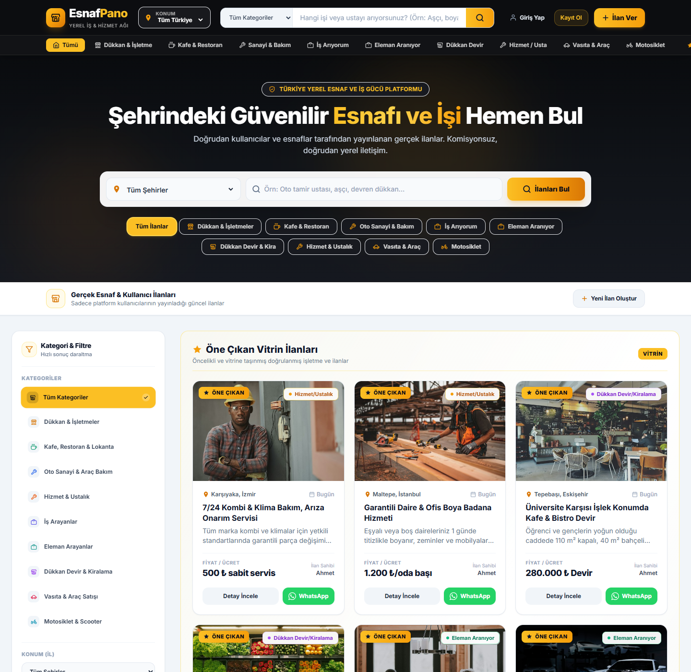](screenshots/01-ana-sayfa.png)

</details>

<details>
<summary><strong>İlan detayı — fotoğraflar, açıklama ve iletişim</strong></summary>

İlanın detaylarını inceleyin; ilan sahibine mesaj gönderin veya paylaşılan iletişim bilgilerini kullanın.

[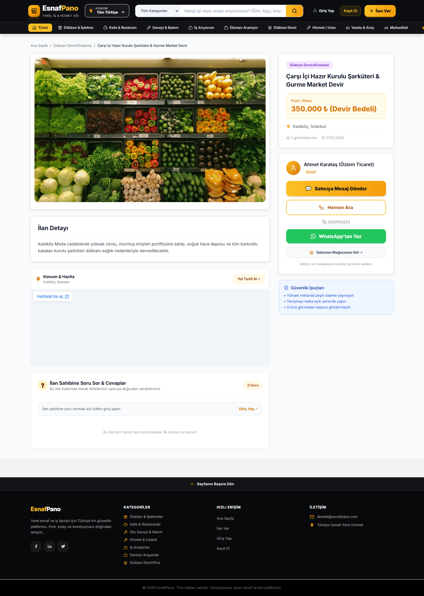](screenshots/02-ilan-detayi.png)

</details>

<details>
<summary><strong>Giriş — kullanıcı oturumu</strong></summary>

E-posta veya telefon numarasıyla hesabınıza giriş yapın.

[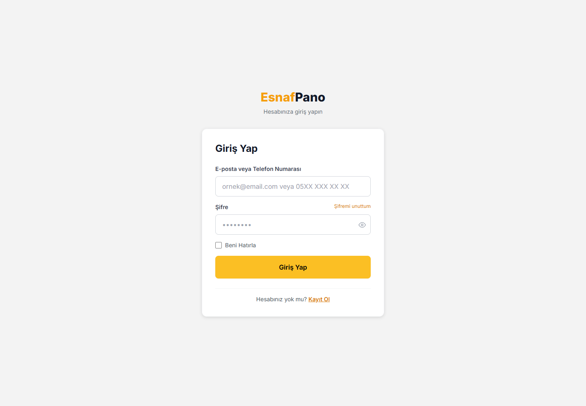](screenshots/03-giris.png)

</details>

<details>
<summary><strong>Kayıt — yeni hesap oluşturma</strong></summary>

Hesap oluşturup ilan, mağaza ve mesajlaşma özelliklerine erişin.

[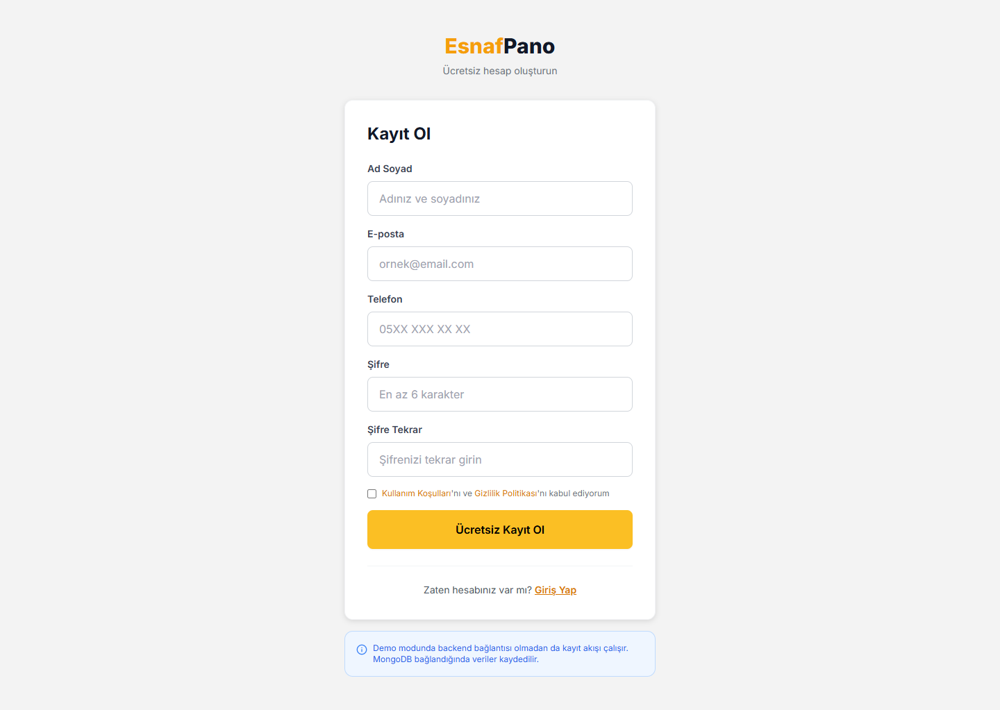](screenshots/04-kayit.png)

</details>

<details>
<summary><strong>İlan oluşturma — kategori ve konum seçimi</strong></summary>

İlanınızın kategorisini, şehrini ve ilçesini seçerek dört adımlı formu başlatın.

[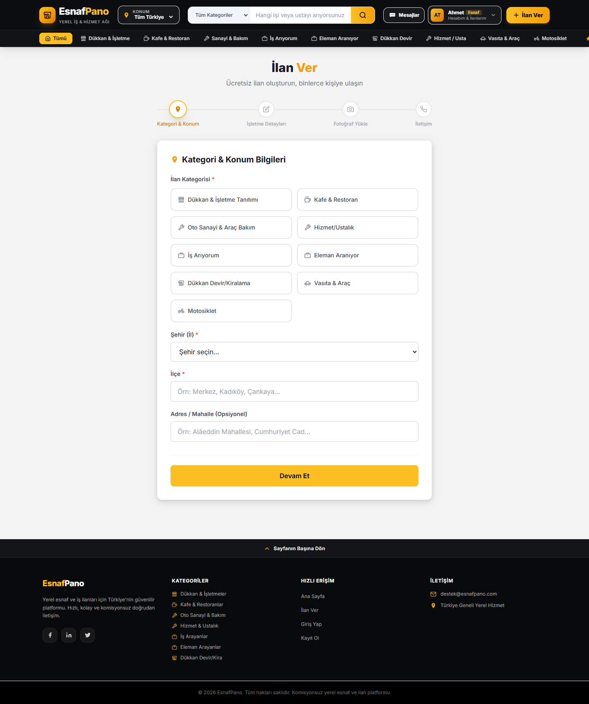](screenshots/05-ilan-olustur.png)

</details>

<details>
<summary><strong>İşletme detayları — hizmetler ve çalışma saatleri</strong></summary>

İşletmenin sektörünü, sunduğu hizmetleri, çalışma saatlerini ve sosyal bağlantılarını ekleyin.

[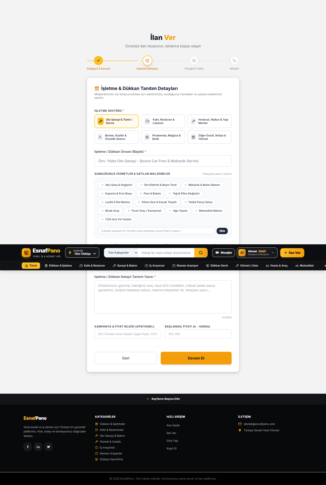](screenshots/06-isletme-detaylari.png)

</details>

<details>
<summary><strong>İlanlarım — ilanları düzenleme ve yönetme</strong></summary>

Kendi ilanlarınızı düzenleyin, yayında/satıldı durumunu değiştirin veya silin.

[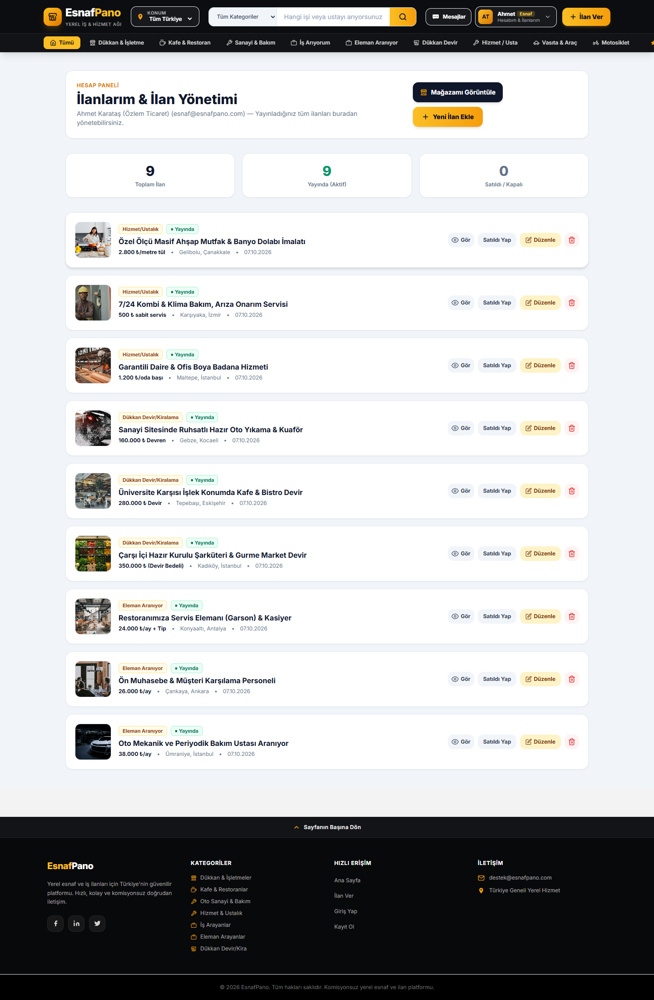](screenshots/07-ilanlarim.png)

</details>

<details>
<summary><strong>Mağaza — profil ve paylaşılabilir mağaza bağlantısı</strong></summary>

İlan sahibinin profilini, yayınladığı ilanları ve mağaza QR kodunu görüntüleyin.

[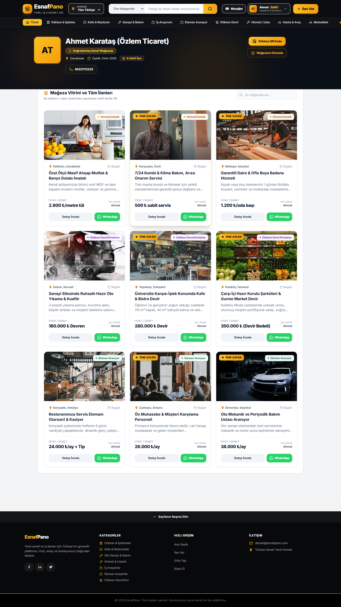](screenshots/08-magaza.png)

</details>

<details>
<summary><strong>Mesajlar — kullanıcılar arasında sohbet</strong></summary>

İlan sahipleriyle yaptığınız konuşmaları aynı ekranda takip edin.

[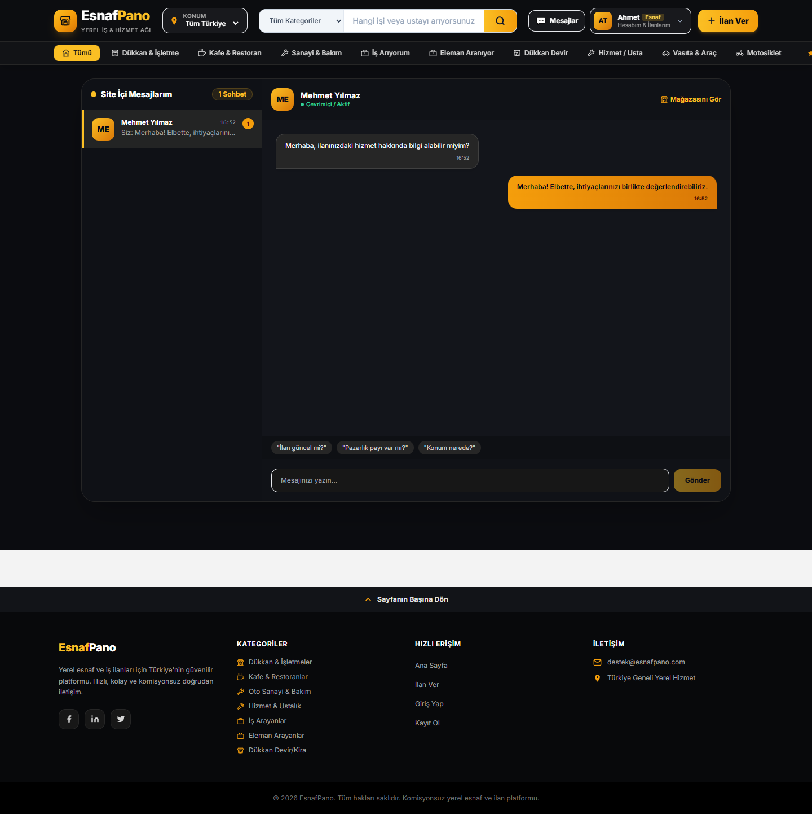](screenshots/09-mesajlar.png)

</details>

<details>
<summary><strong>Yönetici paneli — kullanıcılar, ilanlar ve moderasyon</strong></summary>

Yönetici hesabıyla istatistikleri görüntüleyin ve kullanıcı/ilan yönetimini gerçekleştirin.

[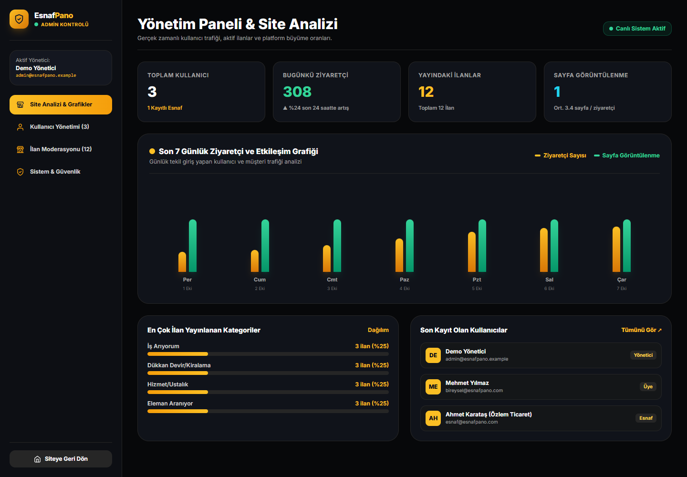](screenshots/10-yonetici-paneli.png)

</details>

<details>
<summary><strong>Mobil görünüm — telefonda ana sayfa</strong></summary>

Arama, kategoriler ve ilan kartlarının telefon ekranındaki görünümü.

<a href="screenshots/11-mobil.png">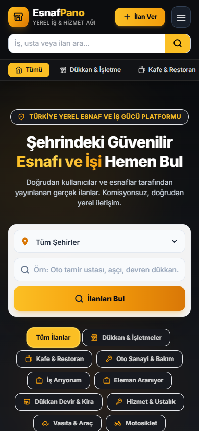</a>

</details>

Görselleri yeniden üretmek için:

```bash
npx playwright install chromium
npm run screenshots
```

Chrome kuruluysa komut onu kullanabilir. Arayüz derlenir; ayrı geçici MongoDB'de demo verileri oluşturulur, ekranlar `docs/screenshots/` dizinine kaydedilir ve geçici ortam kapatılır. Çalışan yerel uygulama ve veritabanınız değiştirilmez.

## Komutlar

Tüm komutları **proje kökünden** çalıştırın.

| Komut | İşlev |
| --- | --- |
| `npm install` | İki çalışma alanının bağımlılıklarını kökten kurar. |
| `npm ci` | Kilit dosyasındaki kesin sürümlerle temiz kurulum yapar. |
| `npm start` / `npm run dev` | Yerel veritabanı, API ve geliştirme arayüzünü açar. |
| `npm run seed` | Mevcut kayıtları silmeden örnek veriler ekler. |
| `npm run build` | Arayüzü `app/client/dist/` içine derler. |
| `npm run lint` | İstemci kodunun statik kontrolünü çalıştırır. |
| `npm run start:prod` | Harici MongoDB ile API ve derlenmiş arayüzü tek portta sunar. |
| `npm run screenshots` | Dokümantasyon için 11 ekran görüntüsü üretir. |

React değişiklikleri tarayıcıya otomatik yansır; API kaynakları Node.js `--watch` moduyla yeniden başlatılır. `global/config/.env` değişikliklerinden sonra kök başlatma işlemini yeniden çalıştırın.

## Yapılandırma

İlk `npm start` `global/config/.env` oluşturur. Paylaşılabilir alanlar `global/config/.env.example` içindedir.

| Değişken | Açıklama |
| --- | --- |
| `MONGODB_URI` | Boş: kalıcı yerel geliştirme DB'si. Dolu: belirtilen MongoDB. |
| `JWT_SECRET` | İlk çalıştırmada benzersiz üretilen oturum anahtarı. |
| `JWT_EXPIRE` | Varsayılan `30d`. |
| `PORT` / `CLIENT_PORT` | API `5000`, geliştirme arayüzü `5173`. |
| `HOST` / `CLIENT_HOST` | Varsayılan `127.0.0.1`; dinleme adresleri. |
| `CLIENT_ORIGIN` | İzin verilen istemci adresi; varsayılan `http://localhost:5173`. Birden fazla adresi virgülle ayırın. |
| `NODE_ENV` | Geliştirmede `development`; `start:prod` üretim modunu seçer. |
| `ADMIN_EMAIL` | Kendi kayıtlı yönetici hesabınızın e-posta adresi; isteğe bağlı. |
| `VITE_API_BASE_URL` | Boşken `/api`. API ayrı sunucudaysa tam adresi yazın; derleme sırasında tarayıcıya açık hale gelir. |

Kurulu MongoDB örneği:

```dotenv
MONGODB_URI=mongodb://127.0.0.1:27017/esnafpano
```

Atlas için kendi bağlantı adresinizi `global/config/.env` içine yazın; Atlas veritabanı kullanıcısını ve ağ erişimini yapılandırın. Gerçek bağlantı bilgilerini README veya ekran görüntülerine eklemeyin.

## Üretimde çalıştırma

`global/config/.env` içinde kendi `MONGODB_URI` adresinizi, en az 32 karakterli `JWT_SECRET` anahtarınızı ve sitenize uygun `CLIENT_ORIGIN` değerini ayarlayın. Dışarıdan erişim için `HOST=0.0.0.0` kullanın.

```bash
npm ci
npm run build
npm run start:prod
```

Arayüz ve API varsayılan olarak **http://localhost:5000** adresinden sunulur. `/giris`, `/magaza/...` gibi doğrudan sayfa bağlantıları desteklenir. Üretim komutu geliştirme veritabanı açmaz; harici MongoDB ister. İnternete açarken HTTPS ve uygulama sürecini yöneten bir servis kullanın.

GitHub'a kaynak yüklemek uygulamayı internette çalıştırmaz. **GitHub Pages tek başına Node.js API'sini ve MongoDB'yi barındıramaz.**

## Klasör yapısı

Ana dizinde gizli dosyalar dahil yalnızca **üç dosya** bulunur: `package.json`, `package-lock.json` ve `.gitignore`. Uygulama `app/`, ortak ayarlar/komutlar `global/`, belgeler `docs/` altında toplanır.

```text
Newproje/
├── package.json              # Kök kurulum ve çalıştırma komutları
├── package-lock.json         # Tek sürüm kilidi
├── .gitignore                # Yerel dosyaları paylaşım dışında tutar
├── app/
│   ├── client/               # React arayüzü, public/ ve src/
│   └── server/               # API, routes/, models/ ve controllers/
├── global/
│   ├── config/
│   │   ├── .env.example      # Paylaşılabilir ayar şablonu
│   │   └── .env              # Yerel ayarlar; GitHub'a gönderilmez
│   ├── scripts/              # start, build, seed ve screenshots komutları
│   ├── data/                 # Kalıcı yerel MongoDB; GitHub'a gönderilmez
│   └── tools/                # Yerel araçlar; GitHub'a gönderilmez
├── docs/
│   ├── README.md             # GitHub tanıtımı ve ayrıntılı rehber
│   ├── README.txt            # Düz metin kurulum rehberi
│   ├── LICENSE.txt           # Kişisel kullanım ve ticari izin koşulları
│   ├── screenshots/          # 11 gerçek ekran görüntüsü
│   └── releases/             # Yerel paylaşım ZIP'i; depoya eklenmez
└── node_modules/             # Kökten kurulan bağımlılıklar; depoya eklenmez
```

`node_modules/`, `global/data/` ve `app/client/dist/` otomatik oluşur; depoya eklenmez. npm dolaylı bağımlılıkların farklı sürümleri için gerekirse alt dizinlerde paketler oluşturabilir; kurulum yine yalnızca kökten yapılır.

## API özeti

| Yol | Amaç |
| --- | --- |
| `GET /api/health` | API ve veritabanı sağlık kontrolü |
| `POST /api/auth/register`, `POST /api/auth/login` | Kayıt ve giriş |
| `GET /api/auth/me`, `PUT /api/auth/profile` | Oturum ve profil |
| `GET /api/listings`, `GET /api/listings/featured` | Filtreli ve öne çıkan ilanlar |
| `POST /api/listings` | Giriş yapmış kullanıcıyla ilan oluşturma |
| `GET/PUT/DELETE /api/listings/:id` | Detay, düzenleme ve silme |
| `GET /api/listings/my`, `GET /api/listings/store/:ownerId` | Kendi ilanları ve mağaza |
| `POST /api/listings/:id/questions` | Soru oluşturma |
| `POST /api/listings/:id/questions/:questionId/answer` | İlan sahibinin yanıtı |
| `/api/messages` | Mesajlar ve sohbet listeleri; giriş gerekir |
| `/api/admin` | Yönetici istatistikleri ve moderasyon |

Korumalı isteklerde `Authorization: Bearer <token>` başlığı kullanılır. Demo kurulumu web üzerinden erişilen bir endpoint yerine yerel `npm run seed` komutuyla yapılır.

## GitHub'a yükleme

GitHub, `docs/README.md` dosyasını depo tanıtımı olarak otomatik gösterebilir; bu nedenle ana dizine ayrı README koymanız gerekmez. [GitHub README rehberi](https://docs.github.com/en/repositories/managing-your-repositorys-settings-and-features/customizing-your-repository/about-readmes).

GitHub'da yeni, boş bir depo oluşturun. Proje kökünde aşağıdaki adresi kendinize göre değiştirip çalıştırın:

```bash
git init
git add .
git status --short
git commit -m "EsnafPano: kurulum, uygulama ve dokumantasyon"
git branch -M main
git remote add origin https://github.com/GITHUB_KULLANICINIZ/DEPO_ADINIZ.git
git push -u origin main
```

`docs/README.md`, `docs/README.txt`, `docs/LICENSE.txt`, `global/config/.env.example`, `package-lock.json` ve `docs/screenshots/` birlikte paylaşılmalıdır. `.gitignore`; bağımlılıkları, gerçek `global/config/.env` dosyalarını, yerel veritabanını, araçları ve geliştirme notlarını dışarıda bırakır. Daha önce Git'e alınmış bir projede `git init`/`remote add` adımlarını mevcut deponuza göre uyarlayın.

Hazır ZIP kullanıyorsanız `EsnafPano/` klasörünün **içindeki dosya ve klasörleri** depo köküne yükleyin. Böylece `package.json` depo kökünde, README ise `docs/README.md` yolunda kalır. ZIP dosyasını tek başına yüklemek yerine içeriğini paylaşın.

**Depo açıklaması önerisi:** `React ve Node.js ile yerel esnaf, işletme ve iş ilanları platformu. Tek komutla geliştirme ortamı, mesajlaşma, mağaza profilleri ve yönetici paneli.`

**Etiketler:** `react`, `nodejs`, `express`, `mongodb`, `turkish`, `classifieds`, `marketplace`, `tailwindcss`.

## Sorun giderme

| Sorun | Çözüm |
| --- | --- |
| `ENOENT ... package.json` | Terminali kök `package.json` bulunan klasörde açın. |
| `npm.ps1 cannot be loaded` | Windows'ta `npm.cmd` kullanın. |
| `EBADENGINE` / Oxlint native binding | Node.js 22 LTS kurup `npm ci` çalıştırın. |
| İlk açılış uzun sürüyor | MongoDB indirmesini bekleyin; sonraki açılışta tekrar indirilmez. |
| MongoDB indirmesi engelleniyor | İnternet/proxy ayarlarını kontrol edin veya MongoDB/Atlas adresini `MONGODB_URI` olarak yazın. |
| Port kullanımda | Açık EsnafPano terminalini kapatın veya `global/config/.env` portlarını değiştirip yeniden başlatın. |
| İlan görünmüyor | Yeni veritabanı boş başlar; `npm run seed` çalıştırın veya giriş yapıp ilan ekleyin. |
| Demo giriş başarısız | Önce `npm run seed` çalıştırın. |
| Harici DB bağlanmıyor | Bağlantı adresi, kullanıcı, şifre ve ağ erişimini kontrol edin. |
| Yönetici bağlantısı görünmüyor | Kayıtlı adresi `ADMIN_EMAIL` yapın; yeniden başlatıp tekrar giriş yapın. |
| Görsel komutu tarayıcı bulamıyor | `npx playwright install chromium` çalıştırın. |
| Harita, QR veya örnek fotoğraf açılmıyor | Harici servisler için internet erişimini kontrol edin. |
| Konum algılanmıyor | Konum izni verin; HTTPS/localhost kullanın veya şehri elle seçin. |

**Mevcut sınırlar:** Şifre sıfırlama bağlantısı henüz tamamlanmış bir akış değildir. Ziyaretçi trendleri örnektir. Google Fonts, harita, QR ve demo fotoğrafları harici servislere bağlıdır. Büyük ölçekli kullanımda ayrı medya depolaması değerlendirilebilir.

## Katkı

Değişikliklerden önce `npm ci`, sonrasında `npm run lint` ve `npm run build` çalıştırın. İlgili kullanıcı akışını tarayıcıda kontrol edin; arayüz değiştiyse görselleri yenileyin.

## Lisans

**Telif hakkı © 2026 [Bewrq](https://github.com/Bewrq) · [Replyfe](http://replyfe.com/).**

Proje, [EsnafPano Kişisel Kullanım Lisansı v1.0](LICENSE.txt) kapsamında paylaşılır.

| Kullanım | Koşul |
| --- | --- |
| Kişisel ve ticari olmayan kullanım, öğrenme ve kişisel değişiklikler | Ücretsiz; telif ve lisans bildirimleri korunmalıdır. |
| Şirket/işletme kullanımı, müşteri projesi, ücretli hizmet veya reklam geliri sağlayan kullanım | Hak sahibinin önceden yazılı izni gerekir. |
| Kodun, değiştirilmiş sürümün veya projeden türetilen ürünün satışı | Hak sahibinin önceden yazılı izni gerekir. |
| GitHub üzerinde görüntüleme ve fork | GitHub koşulları saklıdır; ticari izin yerine geçmez. |
| Diğer yeniden dağıtımlar ve yeniden lisanslama | Lisans metnindeki izin koşullarına tabidir. |

Ticari izin talepleri için [Bewrq](https://github.com/Bewrq) veya [Replyfe](http://replyfe.com/) üzerinden proje sahibiyle iletişime geçin. Yazılı izin alınmadan ticari kullanım hakkı doğmaz. Bu, MIT veya OSI onaylı bir açık kaynak lisansı değildir; MIT ticari kullanıma ve satışa izin verir. [MIT lisans açıklaması](https://choosealicense.com/licenses/mit/).

Bağımlılıklar, harici fotoğraflar, yazı tipleri ve diğer üçüncü taraf içerikler kendi lisanslarına tabidir. Bu lisans yalnızca hak sahibinin hak sahibi olduğu proje içeriğini kapsar. Tam koşullar için [LICENSE.txt](LICENSE.txt) dosyasını okuyun.
